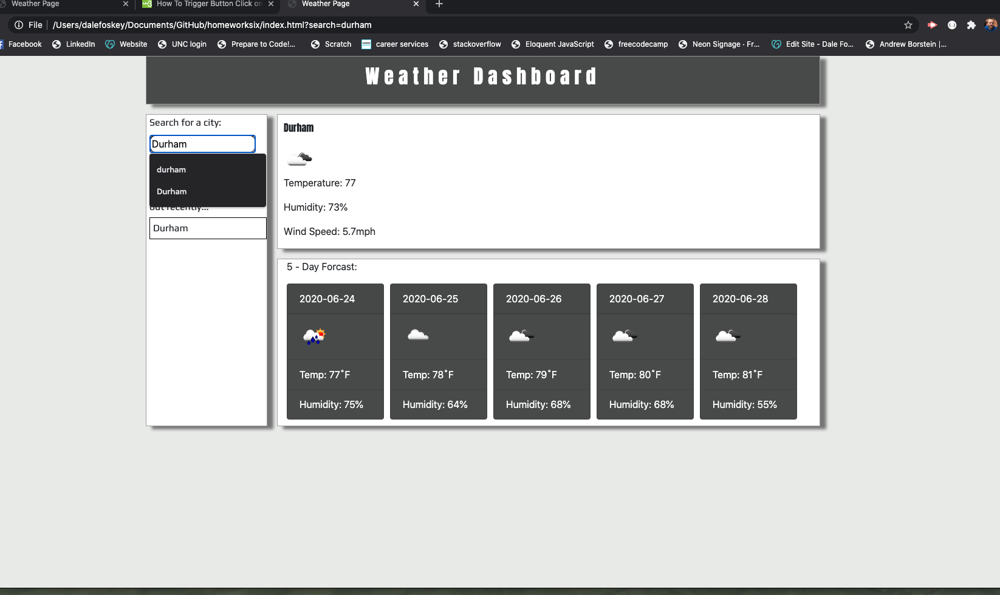

# Homework Assignment 5: Weather App
---

## Description
This project is my 6th project deployed while taking the Web Developer Bootcamp at UNC. I created a weather app that makes it possible to search a city and get the current days forcast as well as the 5 day forcast, you are also able to click on the history items and get the same results. All of this was created with HTML, CSS, Javascript, Jquery, Bootstrap only.

## Getting Started
---
These instructions will get you a copy of the project up and running on your local machine for development and testing purposes. See deploying the game for notes on how to deploy the project on a live system.

## Prerequisites
---
Windows or Mac file expolorer
Working web browers (ie Chrome browser, Mozilla Firefoxi)
Code editing software (ie Sublime text, Visual Studio Code)
Terminal window
internet access

## Installation
---
Using your filesystem explorer locate the html and css files
Then either open the html files in browser for inspection, or using your choice of code editor to edit.

## Deploying the Scheduler
---
From any web browser visit this site  https://jdalefoskey.github.io/homeworksix/ to begin using

## Repository contents
---
All files for the GitHub pages site reside in the  directory and were used only to submit the homepage for the project.
